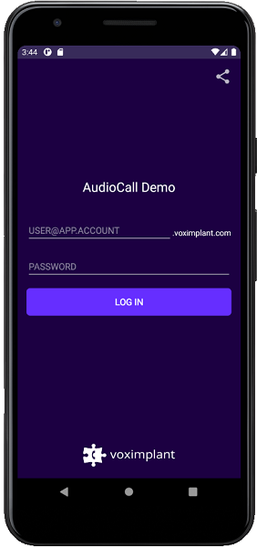
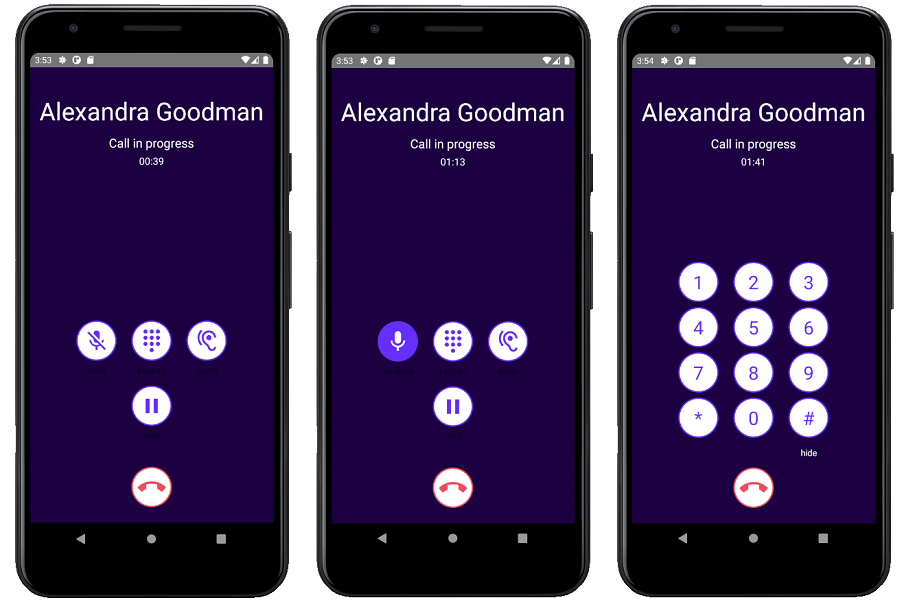

# Voximplant Audio Call Demo (Android)

This demo demonstrates basic audio call functionality of the Voximplant Android SDK. 
The application supports audio calls between this Android app and other apps that use any Voximplant SDK.
Based on MVP architectural pattern.

## Features
The application is able to:
- log in to the Voximplant Cloud
- make an audio call
- receive an incoming call
- put a call on hold / take it off hold
- change an audio device (speaker, receiver, wired headset, bluetooth headset) during a call
- mute audio during a call
- send DTMF
- receive push notifications (requires additional setup)
- turn off the touch screen during calls when your ear is close to the screen (proximity sensor usage)

#### Android 9
Because of the [limited access to sensors in background](https://developer.android.com/about/versions/pie/android-9.0-changes-all#bg-sensor-access) in Android 9,
we have made a foreground service to access microphone while app is in the background.

See the following file for code details:
- [CallService](src/main/java/com/voximplant/demos/audiocall/ui/call/CallService.java) (also used to work with proximity sensor)

#### Android 10
Because of the [restrictions on starting activities from the background](https://developer.android.com/guide/components/activities/background-starts) in Android 10,
we have made NotificationHelper class build and show full screen notifications

See the following file for code details:
- [NotificationHelper](src/main/java/com/voximplant/demos/audiocall/utils/NotificationHelper.java)

## Getting started
To get started, you'll need to [register](https://voximplant.com) a free Voximplant developer account.

You'll need the following:
- Voximplant application
- two Voximplant users
- VoxEngine scenario
- routing setup

### Automatic
We've implemented a special template to enable you to quickly use the demo – just 
install [SDK tutorial](https://manage.voximplant.com/marketplace/sdk_tutorial) from our marketplace:


### Manual
You can set up it manually using our [quickstart guide](https://voximplant.com/docs/references/articles/quickstart) and tutorials

#### VoxEngine scenario example:
  ```
  require(Modules.PushService);
  VoxEngine.addEventListener(AppEvents.CallAlerting, (e) => {
  const newCall = VoxEngine.callUserDirect(
    e.call, 
    e.destination,
    e.callerid,
    e.displayName,
    null
  );
  VoxEngine.easyProcess(e.call, newCall, ()=>{}, true);
  });
  ```

## Installing
1. Clone this repo 

2. Select AudioCall and build the project using Android Studio

## Usage

### User login


Log in using:
* Voximplant user name in the format `user@app.account`
* password

See the following files for code details:
- [VoxClientManager](src/main/java/com/voximplant/demos/audiocall/manager/VoxClientManager.java)
- [LoginPackage](src/main/java/com/voximplant/demos/audiocall/ui/login)

### Make or receive calls


Enter a Voximplant user name to the input field and press "Call" button to make a call.

See the following files for code details:
- [VoxCallManager](src/main/java/com/voximplant/demos/audiocall/manager/VoxCallManager.java)
- [MainPackage](src/main/java/com/voximplant/demos/audiocall/ui/main)
- [incomingCallPackage](src/main/java/com/voximplant/demos/audiocall/ui/incomingcall)

### Audio call controls


Mute, hold, change an audio device or send DTMFs during a call.

See the following files for code details:
- [CallPackage](src/main/java/com/voximplant/demos/audiocall/ui/call)

## Useful links
1. [Quickstart](https://voximplant.com/docs/references/articles/quickstart)
2. [Voximplant Android SDK reference](https://voximplant.com/docs/references/androidsdk)
3. [Using Voximplant Android SDK](https://voximplant.com/docs/references/androidsdk/using-android-sdk)
4. [HowTo's](https://voximplant.com/blog/howto) 
5. [Push Notifications Tutorial](https://voximplant.com/docs/references/androidsdk/push-notifications-for-android)