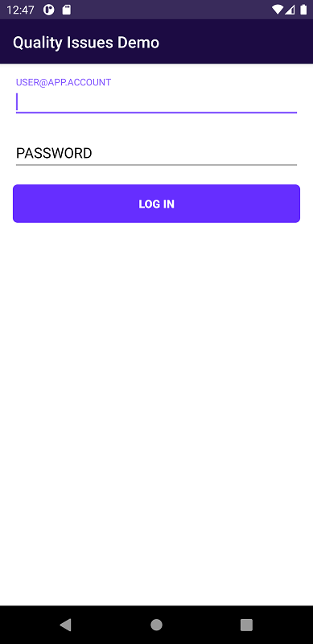

# Voximplant Quality Issues Demo (Android)

This demo demonstrates how to handle quality issues alerts of Voximplant Android SDK. 
The application supports audio/video and conference calls between this Android app and other apps that use any Voximplant SDK.
Based on MVP architectural pattern.

## Key features
The application is able to:
- listen to quality issues
- log in to the Voximplant Cloud
- make an audio/video and conference call


#### Android 9
Because of the [limited access to sensors in background](https://developer.android.com/about/versions/pie/android-9.0-changes-all#bg-sensor-access) in Android 9,
we have made a foreground service to access microphone while app is in the background.

See the following file for code details:
- [CallService](src/main/java/com/voximplant/demos/quality_issues_demo/ui/call/CallService.java)

#### Android 10
Because of the [restrictions on starting activities from the background](https://developer.android.com/guide/components/activities/background-starts) in Android 10,
we have made NotificationHelper class build and show full screen notifications

See the following file for code details:
- [NotificationHelper](src/main/java/com/voximplant/demos/quality_issues_demo/utils/NotificationHelper.java)

## Getting started
To get started, you'll need to [register](https://voximplant.com) a free Voximplant developer account.

You'll need the following:
- Voximplant application
- two Voximplant users
- VoxEngine scenario
- routing setup

### Automatic
We've implemented a special template to enable you to quickly use the demo – just 
install [SDK tutorial](https://manage.voximplant.com/marketplace/sdk_tutorial) from our marketplace:


### Manual
You can set up it manually using our [quickstart guide](https://voximplant.com/docs/references/articles/quickstart) and tutorials

#### VoxEngine scenario example:
  ```
  VoxEngine.addEventListener(AppEvents.CallAlerting, (e) => {
  const newCall = VoxEngine.callUserDirect(
    e.call, 
    e.destination,
    e.callerid,
    e.displayName,
    null
  );
  VoxEngine.easyProcess(e.call, newCall, ()=>{}, true);
  });
  ```

## Installing
1. Clone this repo 

2. Select quality_issues_demo and build the project using Android Studio

## Usage

### User login


Log in using:
* Voximplant user name in the format `user@app.account`
* password

See the following files for code details:
- [VoxClientManager](src/main/java/com/voximplant/demos/quality_issues_demo/manager/VoxClientManager.java)
- [LoginPackage](src/main/java/com/voximplant/demos/quality_issues_demo/ui/login)

### Make or receive calls


Enter a Voximplant user name to the input field, set checkbox to true if you want to make conference and press "Call" button to make a call.

See the following files for code details:
- [VoxCallManager](src/main/java/com/voximplant/demos/quality_issues_demo/manager/VoxCallManager.java)
- [MainPackage](src/main/java/com/voximplant/demos/quality_issues_demo/ui/main)
- [incomingCallPackage](src/main/java/com/voximplant/demos/quality_issues_demo/ui/incomingcall)

### Quality Issues

Quality Issues with current status are listed at the bottom and also logged to the text view on the middle of the screen.

See the following files for code details:
- [CallPackage](src/main/java/com/voximplant/demos/quality_issues_demo/ui/call)

### Call controls

Hold, change video sending or switch camera during a call from options menu. Tap on a video view to enlarge or decrease it.

See the following classes for code details:
- [CallPackage](src/main/java/com/voximplant/demos/quality_issues_demo/ui/call)

## Useful links
1. [Quickstart](https://voximplant.com/docs/introduction)
2. [Voximplant Android SDK reference](https://voximplant.com/docs/references/androidsdk)
4. [HowTo's](https://voximplant.com/blog/howto) 